<div align="center">

  <br />
  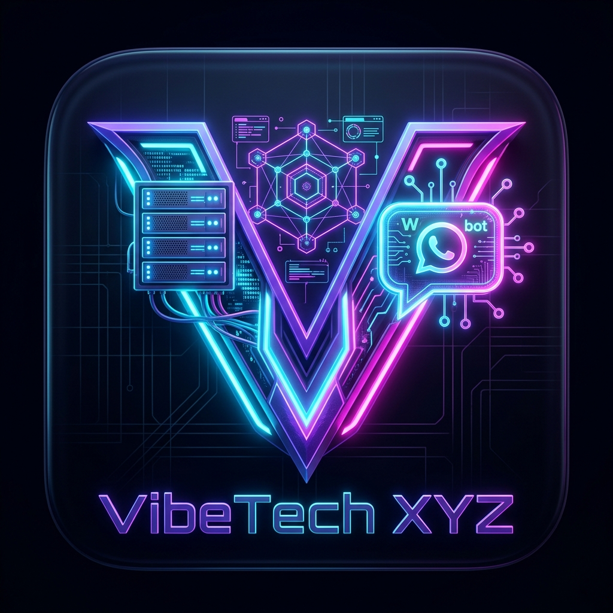
  
  <h1 align="center" style="font-size: 2.4rem; font-weight: 800; margin-top: 15px; margin-bottom: 0px;">
    ⚡ VIBETECH XYZ
  </h1>
  
  <p align="center" style="font-size: 1.1rem; color: #7C4DFF; font-weight: 600; margin-top: 5px;">
    <i>Next-Generation Cloud VPS, WhatsApp Bot & Panel Hosting Ecosystem</i>
  </p>

  <p align="center" style="max-width: 720px; color: #64748B; font-size: 0.95rem; line-height: 1.6;">
    Platform infrastruktur digital all-in-one berbasis <b>Flutter</b>, <b>SQLite (Sqflite FFI)</b>, dan <b>Firebase Multi-Platform Cloud Sync</b> yang menggabungkan kemudahan otomasi server, sistem pembayaran <b>Midtrans Snap</b>, otentikasi biometrik & GitHub/Google, asisten cerdas <b>Furina AI (Gemini-V3)</b>, serta portal administrasi database lengkap.
  </p>

  <!-- BADGES MATRIX -->
  <p align="center">
    
    
    
    
    
    
    
    
  </p>

  <!-- QUICK ACTION BUTTONS -->
  <p align="center">
    <a href="#-mengapa-vibetech-xyz"></a>
    <a href="#-fitur-unggulan"></a>
    <a href="#-tangkapan-layar--galeri-antarmuka"></a>
    <a href="#-skema-database-sqlite"></a>
    <a href="#-panduan-instalasi--menjalankan"></a>
    <a href="#-kredensial-demo--testing"></a>
    <a href="#-kontak--dukungan"></a>
  </p>

  <br />
</div>

---

## 🎯 Mengapa VibeTech XYZ?

> [!NOTE]
> **VibeTech XYZ** dirancang untuk menghadirkan pengalaman sewa dan kelola infrastruktur server yang mulus, aman, dan instan langsung dari genggaman ponsel maupun desktop tanpa memerlukan konfigurasi manual yang rumit.

```
┌─────────────────────────────────────────────────────────────────────────────┐
│                          EKOSISTEM VIBETECH XYZ                             │
├──────────────────────┬──────────────────────┬───────────────────────────────┤
│  🚀 CLOUD VPS        │  🎮 PANEL HOSTING    │  🤖 BOT WHATSAPP              │
│  • KVM Virtualizor   │  • Pterodactyl Node  │  • Otomasi 24/7               │
│  • Full Root SSH     │  • Singapore Server  │  • QR Pairing 8-Digit Code    │
│  • NVMe High-Speed   │  • Anti-DDoS Protect │  • Real-time Runtime Logs     │
└──────────────────────┴──────────────────────┴───────────────────────────────┘
```

### 💡 Solusi Terhadap Masalah Pengguna:
1. **Menghilangkan Kerumitan Setup Manual:** Setup VPS dan bot konvensional yang memakan waktu berjam-jam kini otomatis terbit (Auto-Provisioning) dalam waktu kurang dari 60 detik.
2. **Kemudahan Pembayaran Lokal:** Tidak perlu kartu kredit internasional; pengguna dapat membayar via QRIS Instan, GoPay, DANA, OVO, ShopeePay, dan Virtual Account Bank lokal.
3. **Sentralisasi Layanan Terpadu:** VPS KVM, Panel Pterodactyl, dan Bot WhatsApp dikelola dalam satu aplikasi terpadu dengan saldo dan nota tagihan digital rapi.
4. **Dukungan Cerdas 24/7:** Asisten AI **Furina (Gemini-V3)** siap menjawab pertanyaan produk, konsultasi teknis, dan memandu klaim voucher promo secara interaktif.

---

## ✨ Fitur Unggulan

<table width="100%">
  <tr>
    <td width="50%" valign="top">
      <h3>🔐 1. Autentikasi & Multi-Tier Security</h3>
      <ul>
        <li><b>Multi-Credential Login:</b> Masuk instan menggunakan Email, Username, Google Sign-In, atau GitHub Authentication.</li>
        <li><b>Biometric Authentication:</b> Login cepat 1-klik menggunakan <i>Fingerprint & Face ID</i> via <code>local_auth</code>.</li>
        <li><b>Security PIN 6 Digit:</b> Proteksi ketat untuk checkout pesanan, mutasi saldo, dan perubahan data akun.</li>
        <li><b>2FA & Audit Login History:</b> Pencatatan otomatis riwayat login perangkat, IP provider, dan timestamp.</li>
      </ul>
    </td>
    <td width="50%" valign="top">
      <h3>🛒 2. Katalog Produk & Keranjang Cerdas</h3>
      <ul>
        <li><b>Katalog 3 Kategori Utama:</b> Cloud VPS KVM, Panel Hosting Pterodactyl, & Sewa Bot WA 24/7.</li>
        <li><b>Kupon & Voucher Diskon:</b> Validasi kode promo otomatis (misal: <code>VIBESERVER</code> diskon 30%).</li>
        <li><b>Keranjang Belanja Real-Time:</b> Penyesuaian kuantitas, kalkulasi subtotal, dan diskon instan.</li>
        <li><b>Indikator Ketersediaan Kuota:</b> Pemantauan stok paket server secara live.</li>
      </ul>
    </td>
  </tr>
  <tr>
    <td width="50%" valign="top">
      <h3>💳 3. Multi-Channel Payment & Billing</h3>
      <ul>
        <li><b>Saldo VibeTech:</b> Checkout instan 1-klik menggunakan saldo internal akun.</li>
        <li><b>Midtrans Snap Payment:</b>
          <ul>
            <li><i>E-Wallet:</i> QRIS Instan, GoPay, DANA, OVO, ShopeePay.</li>
            <li><i>Virtual Account:</i> BCA, BRI, BNI, Mandiri, Permata VA.</li>
          </ul>
        </li>
        <li><b>Top Up Saldo Otomatis:</b> Pengisian deposit saldo dengan verifikasi instan.</li>
        <li><b>Invoice & Nota Digital:</b> Nota transaksi resmi yang rapi dan dapat diunduh/dibagikan.</li>
      </ul>
    </td>
    <td width="50%" valign="top">
      <h3>🖥️ 4. Self-Service Server Management</h3>
      <ul>
        <li><b>VPS Management:</b> Informasi IP Publik, port SSH 22, username <code>root</code>, password, OS, dan sisa masa aktif.</li>
        <li><b>Panel Hosting Management:</b> Link direct browser ke panel Pterodactyl beserta kredensial login.</li>
        <li><b>WhatsApp Bot Manager:</b> Tampilan pairing code 8-digit instan, Session ID, status koneksi, dan runtime logs.</li>
      </ul>
    </td>
  </tr>
  <tr>
    <td width="50%" valign="top">
      <h3>🎭 5. Furina AI Assistant (Gemini-V3)</h3>
      <ul>
        <li><b>Karakter Persona Unik:</b> Asisten AI bergaya Diva Teater Fontaine yang elegan, puitis, dan karismatik.</li>
        <li><b>Knowledge Base Lengkap:</b> Memahami seluruh paket server, harga, kode kupon aktif, dan panduan teknis.</li>
        <li><b>Dual Fallback Architecture:</b> Direct Google Generative AI REST SDK + Express Proxy Backend.</li>
      </ul>
    </td>
    <td width="50%" valign="top">
      <h3>👑 6. Portal Admin & Cloud Sync</h3>
      <ul>
        <li><b>CRUD SQLite & Firebase:</b> Sinkronisasi data pengguna, produk, transaksi, dan layanan aktif secara real-time.</li>
        <li><b>Manajemen Pengguna:</b> Ubah saldo, ubah peran (Admin/User), reset PIN, dan kelola member.</li>
        <li><b>Provisioning Server:</b> Pengaturan alokasi IP, port SSH, dan root password pembeli.</li>
        <li><b>Konfigurasi SMTP Email:</b> Pengaturan pengiriman email nota transaksi via Google SMTP permanen.</li>
      </ul>
    </td>
  </tr>
</table>

---

## 📸 Tangkapan Layar & Galeri Antarmuka

<details open>
<summary><b>📱 1. Onboarding, Otentikasi & Keamanan Akun</b></summary>
<br />

| Splash Screen | Login & Biometrik | Registrasi Akun | Lupa Password |
|:---:|:---:|:---:|:---:|
| 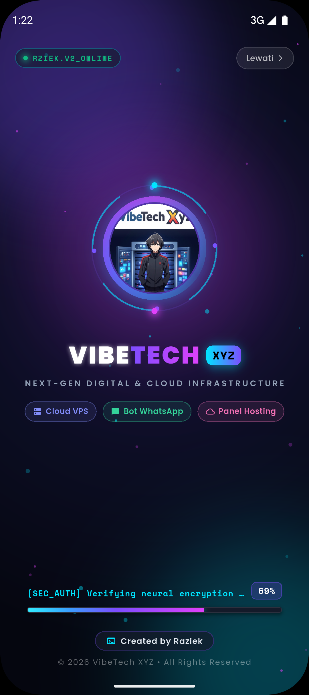 | 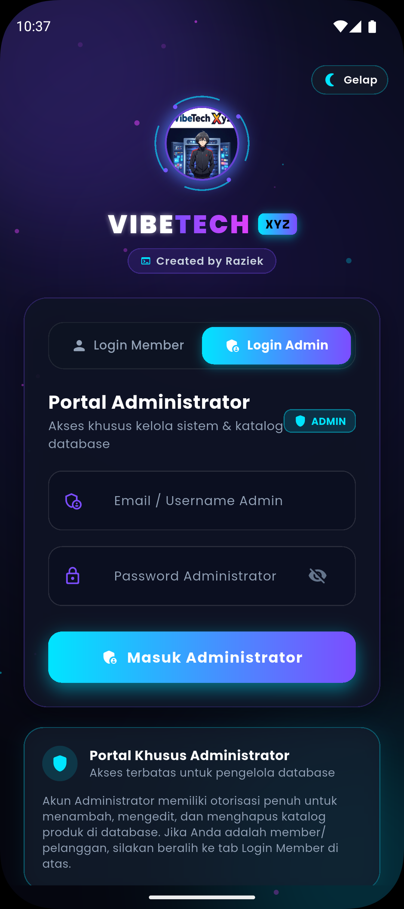 | 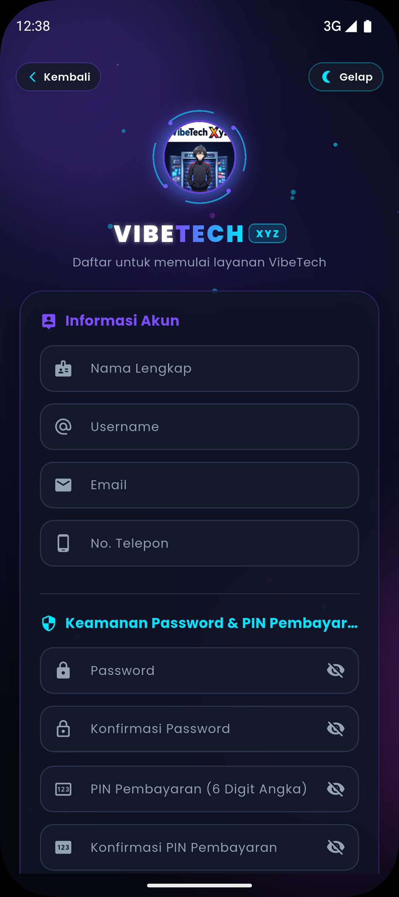 | 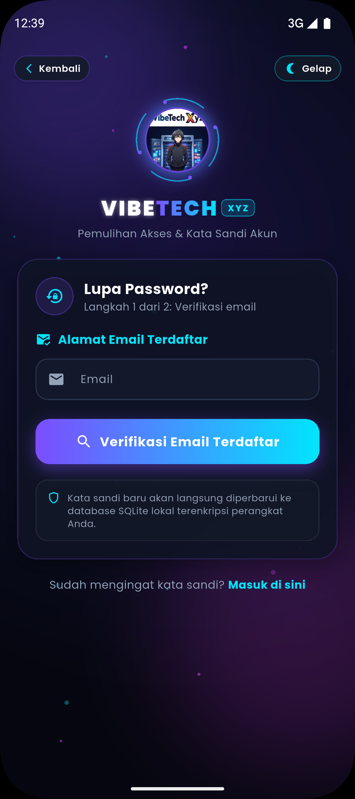 |
| *Splash Animasi Neon* | *Login, Google & GitHub Auth* | *Pendaftaran Member Baru* | *Reset Sandi via Email OTP* |

</details>

<details open>
<summary><b>🛍️ 2. Beranda, Katalog Produk & Transaksi</b></summary>
<br />

| Dashboard Utama | Katalog & Filter Promo | Keranjang Belanja | Konfirmasi Pembayaran |
|:---:|:---:|:---:|:---:|
| 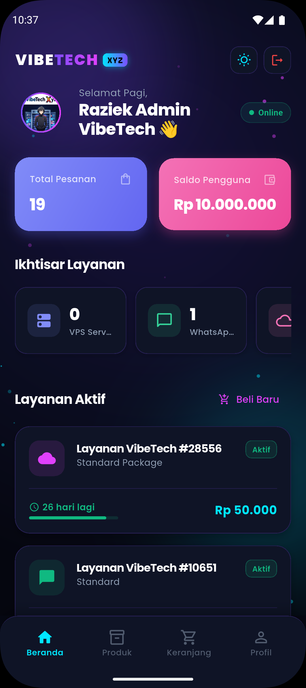 | 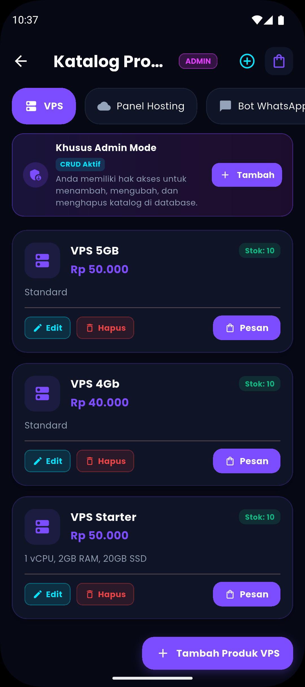 | 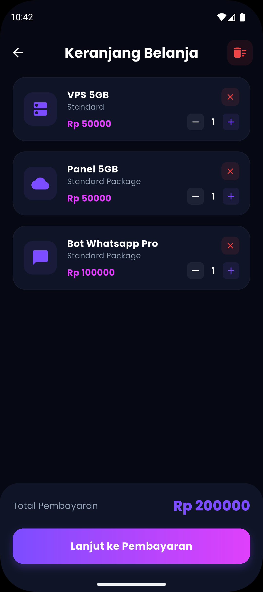 | 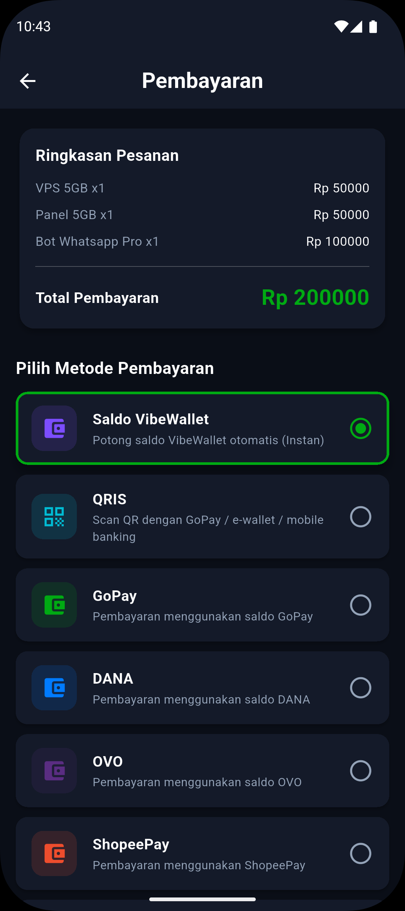 |
| *Dashboard Saldo & Menu* | *Katalog VPS & Panel* | *Keranjang & Voucher Diskon* | *Pilihan Saldo / Midtrans* |

</details>

<details open>
<summary><b>💳 3. Gateway Midtrans, Billing & Manajemen Layanan</b></summary>
<br />

| Midtrans Snap QRIS | Nota Tagihan (Invoice) | Top Up Saldo Akun | Kartu Layanan Aktif |
|:---:|:---:|:---:|:---:|
| 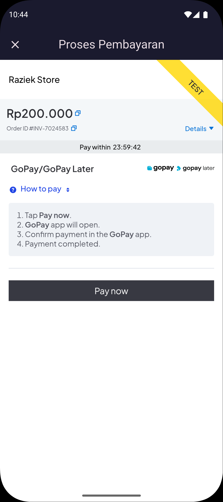 | 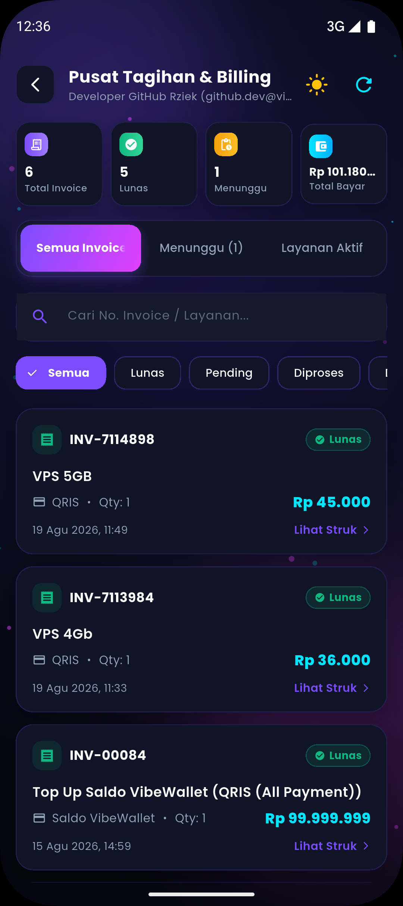 | 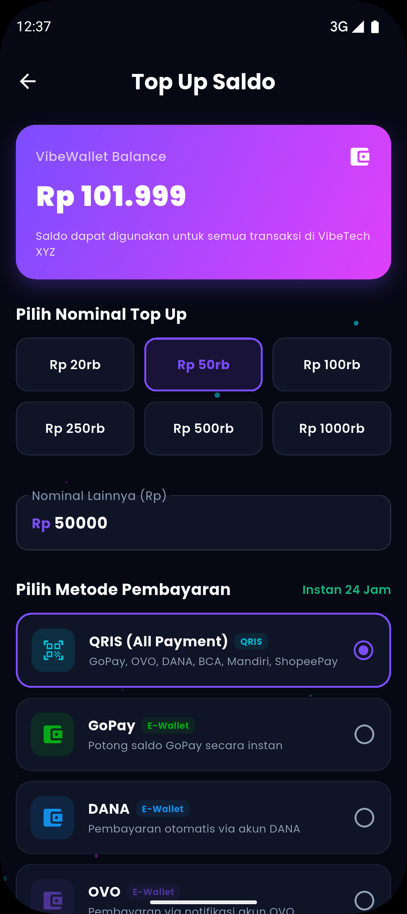 | 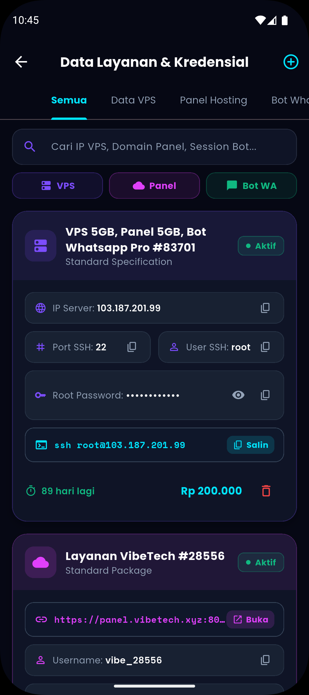 |
| *Pembayaran QRIS & VA* | *Rincian Nota Digital* | *Deposit Saldo Instan* | *IP & Kredensial Server* |

</details>

<details open>
<summary><b>🤖 4. Monitoring, AI Assistant & Portal Admin Database</b></summary>
<br />

| Riwayat Pesanan | Live Chat Furina AI | Bantuan & CS Support | Portal Admin Database |
|:---:|:---:|:---:|:---:|
| 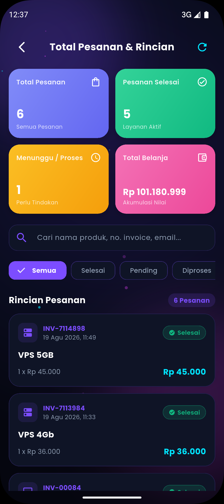 | 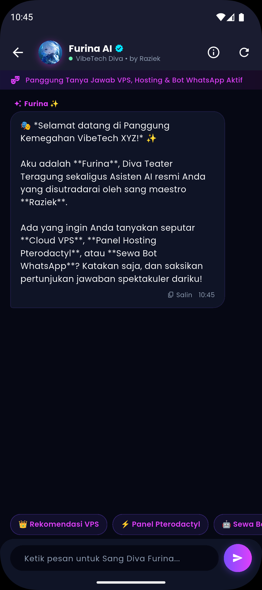 | 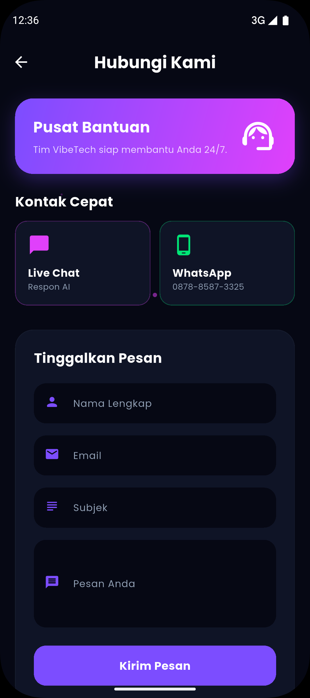 | 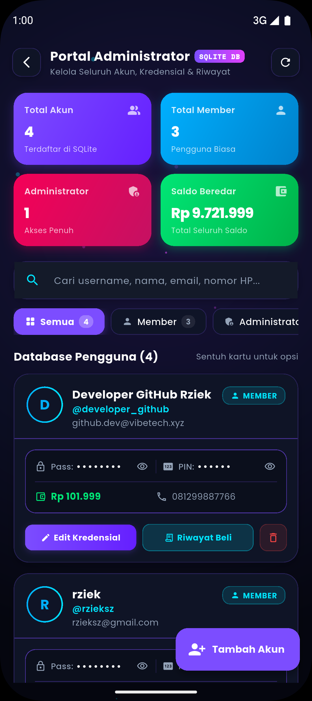 |
| *Daftar Riwayat Invoice* | *Furina AI Assistant* | *Kontak Support Resmi* | *CRUD SQLite Panel Admin* |

</details>

---

## 🗄️ Skema Database SQLite

Database lokal aplikasi menggunakan nama file `vibetech.db` dengan **8 tabel terintegrasi**:

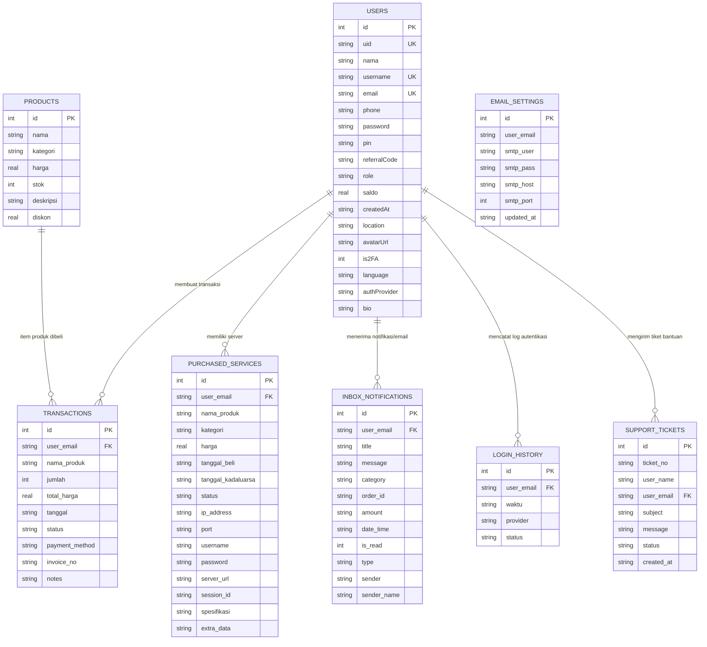

---

## 📂 Struktur Direktori Proyek

```
vibetech_xyz/
├── assets/
│   ├── animation/             # Animasi Lottie (.json)
│   ├── icon/                  # Icon launcher & logo VibeTech
│   ├── images/                # Logo aplikasi & asset QRIS
│   └── ss_vibetech/           # 17 Tangkapan layar antarmuka aplikasi
├── backend/
│   ├── plugins/
│   │   └── furina_scraper.js    # Knowledge base & scraper Furina AI
│   └── server.js              # Express Backend (Midtrans, Nodemailer & AI Proxy)
├── presentation/
│   ├── generate_vibetech_concise_deck.js # Generator PPTX 5-Slide
│   ├── VibeTech_XYZ_Kemudahan_Manfaat_Solusi.pptx # Deck PPTX Resmi
│   └── canva_presentation_guide.md       # Panduan lengkap naskah presenter
├── lib/
│   ├── constants/
│   │   ├── app_colors.dart      # Palet Cyber-Neon & Light theme
│   │   ├── app_constants.dart   # Metadata, kontak, roles & default values
│   │   ├── app_decorations.dart # Gradient, border & shadow styling
│   │   ├── app_dimensions.dart  # Spacing, padding & layout dimensions
│   │   ├── app_particles.dart   # Efek partikel ambient neon
│   │   └── app_styles.dart      # Tipografi Poppins & Outfit
│   ├── database/
│   │   └── db_helper.dart       # SQLite Database Helper (CRUD 8 Tabel Terpadu)
│   ├── models/
│   │   ├── product_model.dart     # Model produk katalog & diskon
│   │   ├── service_model.dart     # Model layanan aktif (VPS/Panel/Bot)
│   │   └── transaction_model.dart # Model riwayat transaksi & nota
│   ├── pages/
│   │   ├── admin/
│   │   │   └── admin_database_page.dart # Portal Admin Database SQLite
│   │   ├── auth/
│   │   │   ├── login_page.dart          # Login, Google, GitHub Auth & Biometrik
│   │   │   ├── register_page.dart       # Registrasi akun member
│   │   │   └── lupa_password_page.dart  # Pemulihan sandi via email OTP
│   │   ├── common/
│   │   │   ├── contact_page.dart        # Form tiket bantuan & kontak CS
│   │   │   ├── data_layanan_page.dart   # Daftar seluruh server & layanan aktif
│   │   │   ├── live_chat_page.dart      # Live Chat Furina AI Assistant
│   │   │   ├── notifikasi_page.dart     # Notifikasi akun & inbox email
│   │   │   ├── splash_page.dart         # Splash screen animasi neon
│   │   │   ├── status_server_page.dart  # Indikator status node server
│   │   │   └── total_pesanan_page.dart  # Riwayat seluruh pesanan & invoice
│   │   ├── home/
│   │   │   ├── dashboard_page.dart      # Beranda utama
│   │   │   ├── keranjang_page.dart      # Keranjang belanja & voucher
│   │   │   ├── produk_page.dart         # Katalog filter produk & voucher
│   │   │   └── profile_page.dart        # Profil akun, PIN, 2FA & tema
│   │   ├── payment/
│   │   │   ├── billing_page.dart        # Invoice & nota digital
│   │   │   ├── pembayaran_page.dart     # Checkout & integrasi Midtrans
│   │   │   └── topup_page.dart          # Isi saldo via QRIS & VA
│   │   └── services/
│   │       ├── data_bot_wa_page.dart    # Detail WhatsApp Bot & pairing code
│   │       ├── data_panel_page.dart     # Detail Pterodactyl Panel Game/Web
│   │       └── data_vps_page.dart       # Detail KVM VPS & Root SSH
│   ├── services/
│   │   ├── ai_chat_service.dart          # Client Gemini-V3 Furina AI
│   │   ├── balance_service.dart          # State manager saldo pengguna
│   │   ├── cart_service.dart             # State manager keranjang belanja
│   │   ├── cloud_sync_service.dart       # Sinkronisasi multi-device SQLite & Firebase
│   │   ├── firebase_email_service.dart   # Sinkronisasi SMTP Email Settings
│   │   ├── firebase_product_service.dart # Sinkronisasi Katalog Produk
│   │   ├── firebase_transaction_service.dart # Sinkronisasi Transaksi & Layanan
│   │   ├── firebase_user_service.dart    # Sinkronisasi Pengguna & Saldo
│   │   ├── github_auth_service.dart      # Layanan GitHub Authentication
│   │   ├── google_auth_service.dart      # Layanan Google Sign-In
│   │   ├── language_service.dart         # Manajer lokalisasi (Indonesia / English)
│   │   ├── notification_service.dart     # Layanan notifikasi & email SMTP
│   │   └── theme_service.dart            # State manager Dark / Light Theme
│   ├── widgets/
│   │   └── google_account_picker_modal.dart # Modal dialog pemilih akun Google
│   ├── firebase_options.dart             # Konfigurasi platform Firebase
│   └── main.dart                         # Titik masuk utama aplikasi Flutter
├── DESIGN.md                             # Dokumentasi Design System Cyber-Neon
├── pubspec.yaml                          # Manajemen pustaka Flutter
└── README.md                             # Dokumentasi resmi repositori
```

---

## 🔑 Kredensial Demo & Testing

Saat pertama kali dijalankan, sistem otomatis menyiapkan akun pengujian bawaan di database lokal:

| Peran (Role) | Username | Email | Password | Saldo Awal | Hak Akses |
|:---|:---|:---|:---|:---:|:---|
| 👑 **Administrator** | `raziek` | `admin@vibetech.com` | `razieksz` | **Rp 10.000.000** | Akses penuh Portal Admin Database SQLite |
| 👤 **Demo Member** | `demouser` | `user@vibetech.com` | `password123` | **Rp 0** | Dashboard, Order VPS/Panel/Bot, Top Up Saldo |

* **PIN Transaksi Bawaan**: `123456`
* **Kode Voucher Promo**: `VIBESERVER` (Diskon 30% all items)

---

## 🚀 Panduan Instalasi & Menjalankan

### 1. Prasyarat Sistem
* **Flutter SDK**: Versi `>= 3.0.0`
* **Dart SDK**: Versi `>= 3.0.0`
* **Node.js**: Versi `>= 18.x` & npm

---

### 2. Pemasangan Dependensi

```bash
# 1. Masuk ke direktori repositori
cd vibetech_xyz

# 2. Pasang pustaka Flutter
flutter pub get

# 3. Masuk ke folder backend dan pasang pustaka Node.js
cd backend
npm install
cd ..
```

---

### 3. Menjalankan Backend Express (Opsional / Recommended)

```bash
cd backend
node server.js
```
> Server akan aktif di `http://localhost:3000` (melayani Midtrans Snap, Nodemailer, dan Furina AI Proxy).

---

### 4. Menjalankan Aplikasi Flutter

```bash
# Jalankan di Android Emulator / Perangkat Fisik
flutter run

# Jalankan di Desktop Windows (Mendukung Sqflite FFI)
flutter run -d windows

# Jalankan di Browser Chrome
flutter run -d chrome
```

---

## 🛠️ Tech Stack & Pustaka Utama

| Bagian | Teknologi / Pustaka | Kegunaan |
|:---|:---|:---|
| **UI Framework** | [Flutter 3.x](https://flutter.dev) & [Dart](https://dart.dev) | UI toolkit modern multi-platform responsif |
| **Local Database** | [`sqflite`](https://pub.dev/packages/sqflite) & [`sqflite_common_ffi`](https://pub.dev/packages/sqflite_common_ffi) | Engine SQLite multi-platform (Android, Windows, Linux, macOS) |
| **Cloud Sync & Auth** | [`firebase_core`](https://pub.dev/packages/firebase_core), [`firebase_auth`](https://pub.dev/packages/firebase_auth), [`cloud_firestore`](https://pub.dev/packages/cloud_firestore) | Sinkronisasi multi-device & otentikasi cloud |
| **Keamanan Biometrik** | [`local_auth`](https://pub.dev/packages/local_auth) | Autentikasi sidik jari (Fingerprint) & Face ID |
| **Otentikasi Akun** | [`google_sign_in`](https://pub.dev/packages/google_sign_in) & GitHub Auth | Otentikasi Google & GitHub resmi |
| **AI Assistant** | [`google_generative_ai`](https://pub.dev/packages/google_generative_ai) & REST API | Furina AI Persona Engine (Gemini-V3) |
| **Payment Gateway** | [`midtrans-client`](https://www.npmjs.com/package/midtrans-client) | Integrasi Snap Gateway (QRIS, E-Wallet & VA) |
| **Email Notifikasi** | [`mailer`](https://pub.dev/packages/mailer) & [`nodemailer`](https://nodemailer.com) | Pengiriman email otomatis nota transaksi via Google SMTP |
| **Visual & Animasi** | [`google_fonts`](https://pub.dev/packages/google_fonts), [`hugeicons`](https://pub.dev/packages/hugeicons), [`lottie`](https://pub.dev/packages/lottie) | Tipografi Poppins/Outfit, ikon modern & animasi Lottie |
| **Utility** | [`qr_flutter`](https://pub.dev/packages/qr_flutter), [`intl`](https://pub.dev/packages/intl), [`shared_preferences`](https://pub.dev/packages/shared_preferences) | Generator QR Code, format mata uang IDR & penyimpanan lokal |

---

## 💬 Kontak & Dukungan

Jika Anda membutuhkan bantuan, memiliki pertanyaan teknis, atau ingin berkolaborasi:

<div align="center">

| Grand Director & Lead Developer | WhatsApp Support | Email Resmi | Website |
|:---:|:---:|:---:|:---:|
| **Raziek** | [**+62 878-8587-3325**](https://wa.me/6287885873325) | [**support@vibetech.xyz**](mailto:support@vibetech.xyz) | [**vibetech.xyz**](https://vibetech.xyz) |

<br />

<sub>Didesain dan dikembangkan dengan penuh dedikasi oleh <b>Raziek</b> • &copy; 2026 <b>VibeTech XYZ</b>. Seluruh hak cipta dilindungi undang-undang.</sub>

</div>
