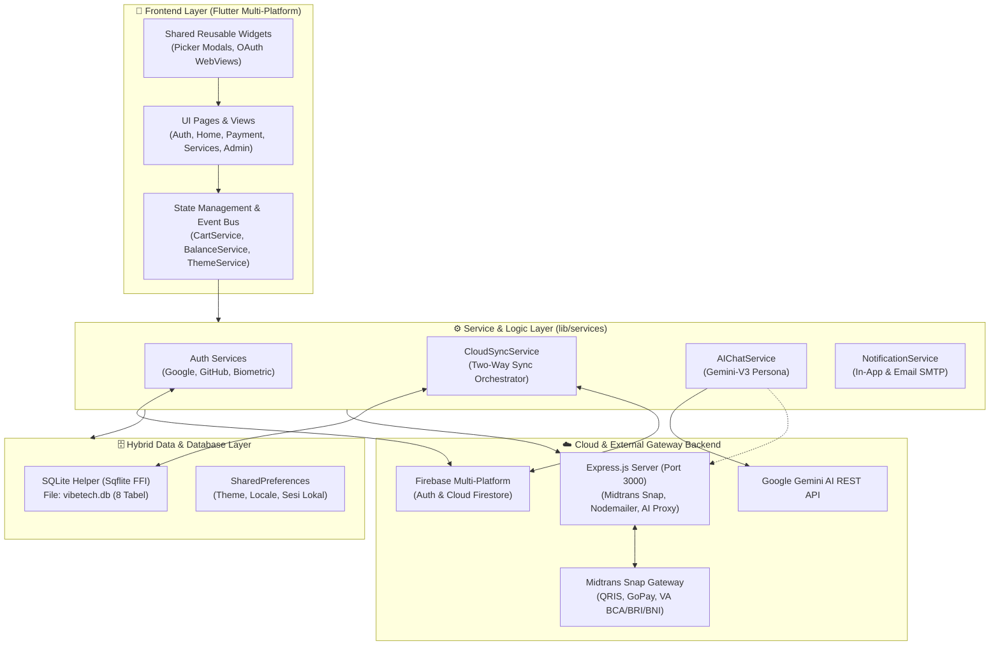
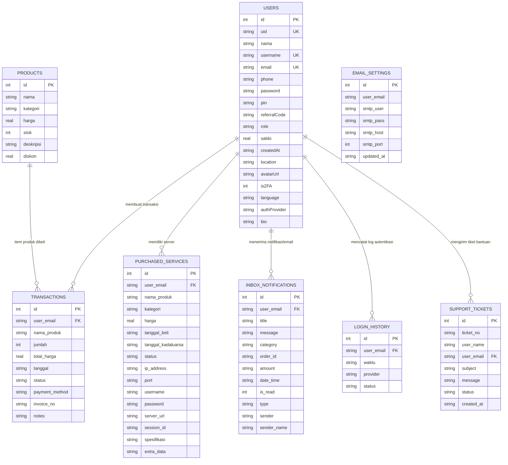

<div align="center">

  <br />
  
  
  <h1 align="center" style="font-size: 2.4rem; font-weight: 800; margin-top: 15px; margin-bottom: 0px;">
    ⚡ VIBETECH XYZ
  </h1>
  
  <p align="center" style="font-size: 1.1rem; color: #7C4DFF; font-weight: 600; margin-top: 5px;">
    <i>Next-Generation Cloud VPS, WhatsApp Bot & Panel Hosting Ecosystem</i>
  </p>

  <p align="center" style="max-width: 760px; color: #94A3B8; font-size: 0.95rem; line-height: 1.6;">
    Platform infrastruktur digital all-in-one berbasis <b>Flutter</b>, <b>SQLite (Sqflite FFI)</b>, dan <b>Firebase Cloud Multi-Platform Sync</b> yang mengintegrasikan otomatisasi provisioning server, payment gateway <b>Midtrans Snap</b>, otentikasi multi-provider (Google, GitHub, Biometrik), asisten cerdas <b>Furina AI (Gemini-V3)</b>, serta portal manajemen database terpadu.
  </p>

  <!-- BADGES MATRIX -->
  <p align="center">
    
    
    
    
    
    
    
    
  </p>

  <!-- QUICK ACTION BUTTONS -->
  <p align="center">
    <a href="#-mengapa-vibetech-xyz"></a>
    <a href="#-fitur-unggulan"></a>
    <a href="#-tangkapan-layar--galeri-antarmuka"></a>
    <a href="#-arsitektur-sistem--aliran-data"></a>
    <a href="#-penjelasan-lengkap-struktur-folder--file"></a>
    <a href="#-skema-database-sqlite"></a>
    <a href="#-panduan-instalasi--menjalankan"></a>
    <a href="#-kredensial-demo--testing"></a>
  </p>

  <br />
</div>

---

## 🎯 Mengapa VibeTech XYZ?

> [!NOTE]
> **VibeTech XYZ** dirancang untuk menghadirkan pengalaman sewa dan kelola infrastruktur server modern yang instan, aman, dan tanpa hambatan teknis. Semua layanan terpusat dalam satu dashboard cerdas yang dapat diakses melalui platform Mobile (Android/iOS) maupun Desktop (Windows/Linux/macOS) serta Web.

```
┌─────────────────────────────────────────────────────────────────────────────┐
│                          EKOSISTEM VIBETECH XYZ                             │
├──────────────────────┬──────────────────────┬───────────────────────────────┤
│  🚀 CLOUD VPS        │  🎮 PANEL HOSTING    │  🤖 BOT WHATSAPP              │
│  • KVM Virtualizor   │  • Pterodactyl Node  │  • Otomasi 24/7               │
│  • Full Root SSH     │  • Singapore Server  │  • QR Pairing 8-Digit Code    │
│  • NVMe High-Speed   │  • Anti-DDoS Protect │  • Real-time Runtime Logs     │
└──────────────────────┴──────────────────────┴───────────────────────────────┘
```

### 💡 Solusi Utama Terhadap Masalah Pengguna:
1. **Otomatisasi Provisioning Instan:** Setup server KVM dan bot WhatsApp yang biasanya memerlukan konfigurasi terminal rumit kini langsung aktif dalam hitungan detik setelah checkout.
2. **Fleksibilitas Pembayaran Multi-Channel:** Mendukung Saldo Internal VibeTech serta gerbang pembayaran **Midtrans Snap** (QRIS Instan, GoPay, DANA, OVO, ShopeePay, dan Virtual Account Bank BCA, BRI, BNI, Mandiri, Permata).
3. **Sinkronisasi Multi-Perangkat:** Menggabungkan ketangguhan **SQLite Lokal** (offline-first, zero latency) dengan **Firebase Cloud Sync** untuk sinkronisasi akun, transaksi, dan layanan secara otomatis antar perangkat.
4. **Asisten AI Interaktif (Furina AI):** Konsultasi teknis, pemilihan spesifikasi server, dan klaim promo dipandu oleh AI persona berbasis model Google Gemini-V3.
5. **Keamanan Berlapis (Multi-Tier Security):** Dilengkapi otentikasi biometrik sidik jari/Face ID, proteksi PIN 6 digit untuk transaksi sensitif, dan sistem otentikasi sosial resmi Google & GitHub.

---

## ✨ Fitur Unggulan

<table width="100%">
  <tr>
    <td width="50%" valign="top">
      <h3>🔐 1. Autentikasi & Keamanan Tingkat Lanjut</h3>
      <ul>
        <li><b>Multi-Provider Login:</b> Email & Password, Username, Google Sign-In resmi, dan GitHub OAuth 2.0.</li>
        <li><b>Biometric Authentication:</b> Login instan 1-klik via <i>Fingerprint & Face ID</i> menggunakan <code>local_auth</code>.</li>
        <li><b>Security PIN 6 Digit:</b> Verifikasi wajib untuk checkout pembelian, transfer saldo, dan perubahan konfigurasi penting.</li>
        <li><b>Lupa Password & OTP:</b> Reset kata sandi melalui pengiriman kode OTP ke email pengguna.</li>
        <li><b>Audit Login History:</b> Pencatatan riwayat sesi perangkat, provider, dan timestamp.</li>
      </ul>
    </td>
    <td width="50%" valign="top">
      <h3>🛒 2. Katalog Produk & Keranjang Belanja</h3>
      <ul>
        <li><b>3 Kategori Server Utama:</b> Cloud VPS KVM NVMe, Game & Web Panel Pterodactyl, dan Sewa Bot WA 24/7.</li>
        <li><b>Filter & Real-Time Search:</b> Pencarian cepat berdasarkan kategori, harga, diskon, dan spesifikasi.</li>
        <li><b>Sistem Kupon & Diskon:</b> Validasi kupon promo dinamis (contoh: <code>VIBESERVER</code> potongan 30%).</li>
        <li><b>Keranjang Belanja Reaktif:</b> State management keranjang instan dengan kalkulasi subtotal otomatis.</li>
      </ul>
    </td>
  </tr>
  <tr>
    <td width="50%" valign="top">
      <h3>💳 3. Pembayaran & Invoice Digital</h3>
      <ul>
        <li><b>Saldo VibeTech:</b> Checkout instan 1-tap menggunakan saldo akun internal.</li>
        <li><b>Midtrans Snap Payment Gateway:</b>
          <ul>
            <li><i>E-Wallet:</i> QRIS Instan, GoPay, DANA, OVO, ShopeePay.</li>
            <li><i>Virtual Account:</i> BCA, BRI, BNI, Mandiri, Permata VA.</li>
          </ul>
        </li>
        <li><b>Top Up Saldo Otomatis:</b> Pengisian deposit instan dengan verifikasi status real-time.</li>
        <li><b>Nota Digital & Email SMTP:</b> Penerbitan invoice terstruktur dan pengiriman bukti transaksi via Google SMTP.</li>
      </ul>
    </td>
    <td width="50%" valign="top">
      <h3>🖥️ 4. Manajemen Layanan Mandiri (Self-Service)</h3>
      <ul>
        <li><b>KVM VPS Manager:</b> Akses IP Publik, port SSH 22, username <code>root</code>, password, OS, dan sisa masa aktif.</li>
        <li><b>Panel Hosting Manager:</b> Akses URL Pterodactyl, username, password, dan alokasi resource CPU/RAM.</li>
        <li><b>WhatsApp Bot Manager:</b> Tampilan pairing code 8 digit instan, Session ID, status server, dan runtime terminal logs.</li>
        <li><b>Daftar Layanan Terpadu:</b> Filter layanan aktif dan masa kedaluwarsa dalam satu halaman.</li>
      </ul>
    </td>
  </tr>
  <tr>
    <td width="50%" valign="top">
      <h3>🎭 5. Furina AI Assistant (Gemini-V3)</h3>
      <ul>
        <li><b>Persona Unik:</b> Asisten cerdas dengan kepribadian Furina bergaya Diva Fontaine yang karismatik dan solutif.</li>
        <li><b>Knowledge Base Terintegrasi:</b> Memahami seluruh katalog paket server, harga, kode voucher, dan panduan teknis.</li>
        <li><b>Arsitektur Dual-Fallback:</b> Direct REST API SDK <code>google_generative_ai</code> dengan fallback ke Express Node.js Proxy.</li>
      </ul>
    </td>
    <td width="50%" valign="top">
      <h3>👑 6. Portal Administrasi & Cloud Sync</h3>
      <ul>
        <li><b>Manajemen 8 Tabel Database:</b> CRUD penuh SQLite & Firebase untuk Users, Products, Transactions, Services, dll.</li>
        <li><b>User & Balance Manager:</b> Penyesuaian saldo pengguna, modifikasi role (Admin/User), dan reset PIN transaksi.</li>
        <li><b>Server Provisioning:</b> Konfigurasi parameter alokasi IP, port SSH, dan kredensial server pelanggan.</li>
        <li><b>Pengaturan SMTP Email:</b> Konfigurasi host, port, username, dan app password SMTP Google langsung dari panel.</li>
      </ul>
    </td>
  </tr>
</table>

---

## 📸 Tangkapan Layar & Galeri Antarmuka

<details open>
<summary><b>📱 1. Onboarding, Otentikasi & Keamanan Akun</b></summary>
<br />

| Splash Screen | Login & Biometrik | Registrasi Akun | Lupa Password |
|:---:|:---:|:---:|:---:|
|  |  |  |  |
| *Splash Animasi Neon* | *Login, Google & GitHub Auth* | *Pendaftaran Member Baru* | *Reset Sandi via Email OTP* |

</details>

<details open>
<summary><b>🛍️ 2. Beranda, Katalog Produk & Transaksi</b></summary>
<br />

| Dashboard Utama | Katalog & Filter Promo | Keranjang Belanja | Konfirmasi Pembayaran |
|:---:|:---:|:---:|:---:|
|  |  |  |  |
| *Dashboard Saldo & Menu* | *Katalog VPS & Panel* | *Keranjang & Voucher Diskon* | *Pilihan Saldo / Midtrans* |

</details>

<details open>
<summary><b>💳 3. Gateway Midtrans, Billing & Manajemen Layanan</b></summary>
<br />

| Midtrans Snap QRIS | Nota Tagihan (Invoice) | Top Up Saldo Akun | Kartu Layanan Aktif |
|:---:|:---:|:---:|:---:|
|  |  |  |  |
| *Pembayaran QRIS & VA* | *Rincian Nota Digital* | *Deposit Saldo Instan* | *IP & Kredensial Server* |

</details>

<details open>
<summary><b>🤖 4. Monitoring, AI Assistant & Portal Admin Database</b></summary>
<br />

| Riwayat Pesanan | Live Chat Furina AI | Bantuan & CS Support | Portal Admin Database |
|:---:|:---:|:---:|:---:|
|  |  |  |  |
| *Daftar Riwayat Invoice* | *Furina AI Assistant* | *Kontak Support Resmi* | *CRUD SQLite Panel Admin* |

</details>

---

## 🏛️ Arsitektur Sistem & Aliran Data

Aplikasi menerapkan pola arsitektur **Layered Service-Oriented Model-View-Service** dengan sinkronisasi data ganda (Hybrid Local-First with Cloud Sync):



---

## 📂 Penjelasan Lengkap Struktur Folder & File

Berikut adalah peta struktur direktori lengkap repositori **VibeTech XYZ** beserta fungsi dan tanggung jawab masing-masing berkas:

```
vibetech_xyz/
├── 📁 assets/                     # Asset statis, gambar, animasi, ikon & screenshot
│   ├── 📁 animation/              # Berkas animasi JSON Lottie
│   ├── 📁 icon/                   # Ikon launcher multi-platform & logo
│   ├── 📁 images/                 # Gambar identitas brand & ilustrasi QRIS
│   └── 📁 ss_vibetech/            # 17 Tangkapan layar antarmuka aplikasi
├── 📁 backend/                    # Layanan backend Node.js & Express API
│   ├── 📁 plugins/
│   │   └── furina_scraper.js      # Knowledge base sistem & parser Furina AI
│   ├── package.json               # Dependensi backend (Express, Midtrans, Nodemailer)
│   └── server.js                  # Express API (Midtrans Snap, Email SMTP & AI Proxy)
├── 📁 presentation/               # Slide presentasi deck & aset promosi
│   ├── 📁 screenshots/            # Aset tangkapan layar untuk materi presentasi
│   ├── app.js                     # Logika viewer presentasi web
│   ├── canva_presentation_guide.md# Panduan lengkap naskah presenter & visual
│   ├── generate_pptx.js           # Script otomatis pembuatan slide PPTX komprehensif
│   ├── generate_screenshots.js    # Script Puppeteer penangkap screenshot otomatis
│   ├── generate_vibetech_concise_deck.js # Script pembuat PPTX ringkas 5-slide
│   ├── index.html                 # Halaman interaktif presentasi pitch deck
│   ├── style.css                  # Styling presentasi web bertema Cyber Neon
│   ├── VibeTech_XYZ_Kemudahan_Manfaat_Solusi.pptx # Deck PPTX 5-Slide Ringkas
│   └── VibeTech_XYZ_Presentation_Deck.pptx        # Deck PPTX Lengkap Resmi
├── 📁 lib/                        # Kode sumber utama aplikasi Flutter
│   ├── 📁 constants/              # Token desain, warna, tema, dimensi & gaya
│   ├── 📁 database/               # Driver & skema SQLite lokal
│   ├── 📁 models/                 # Model data entitas bisnis & serialisasi
│   ├── 📁 pages/                  # Halaman tampilan antarmuka (UI Views)
│   │   ├── 📁 admin/              # Portal administrasi database & pengguna
│   │   ├── 📁 auth/               # Alur autentikasi, registrasi & reset sandi
│   │   ├── 📁 common/             # Halaman umum, chat AI, notifikasi & tiket
│   │   ├── 📁 home/               # Dashboard, produk, keranjang & profil
│   │   ├── 📁 payment/            # Checkout, invoice & top up saldo
│   │   └── 📁 services/           # Manajemen detail VPS, Panel & Bot WA
│   ├── 📁 services/               # State management, cloud sync, auth & API
│   ├── 📁 widgets/                # Komponen dialog & modal dapat digunakan ulang
│   ├── firebase_options.dart      # Konfigurasi platform resmi Firebase
│   └── main.dart                  # Titik masuk utama aplikasi (Main Entry Point)
├── 📁 test/                       # 15 Berkas unit & integration testing
├── DESIGN.md                      # Dokumentasi Design System Cyber Neon
├── pubspec.yaml                   # Deklarasi pustaka dependensi Flutter
└── README.md                      # Dokumentasi utama proyek
```

---

### 1. 📁 `lib/constants/` — Desain Token & Konfigurasi Global
Menyediakan standardisasi tema, dimensi, efek animasi, dan konstanta yang digunakan seragam di seluruh halaman aplikasi.

| File | Deskripsi & Tanggung Jawab |
|:---|:---|
| [app_colors.dart](file:///d:/vibetech_xyz_sqflite/vibetech_xyz/lib/constants/app_colors.dart) | Palet warna utama *Cyber Neon* (`neonPurple`, `cyberCyan`, `neonPink`, `darkBackground`, `cardBackground`) serta palet *Light Theme*. |
| [app_constants.dart](file:///d:/vibetech_xyz_sqflite/vibetech_xyz/lib/constants/app_constants.dart) | Konstanta statis: informasi kontak CS WhatsApp, peran pengguna (`admin`/`user`), spesifikasi server default, dan kode voucher promo bawaan (`VIBESERVER`). |
| [app_decorations.dart](file:///d:/vibetech_xyz_sqflite/vibetech_xyz/lib/constants/app_decorations.dart) | Utility dekorasi UI: Glassmorphism container, border glow gradien neon, inner shadow, dan efek neon card. |
| [app_dimensions.dart](file:///d:/vibetech_xyz_sqflite/vibetech_xyz/lib/constants/app_dimensions.dart) | Standardisasi ukuran margin, padding, border radius, ukuran ikon, dan skala responsif. |
| [app_particles.dart](file:///d:/vibetech_xyz_sqflite/vibetech_xyz/lib/constants/app_particles.dart) | Custom Painter untuk efek partikel melayang neon dinamis pada background halaman login dan dashboard. |
| [app_styles.dart](file:///d:/vibetech_xyz_sqflite/vibetech_xyz/lib/constants/app_styles.dart) | Definisi gaya tipografi modern menggunakan Google Fonts (*Poppins* & *Outfit*) dengan hierarki heading yang rapi. |
| [constants.dart](file:///d:/vibetech_xyz_sqflite/vibetech_xyz/lib/constants/constants.dart) | Ekspor shortcut konstanta global untuk kemudahan impor. |

---

### 2. 📁 `lib/database/` — Database SQLite Lokal
Lapisan penyimpanan lokal berbasis SQLite yang menjamin performa cepat, zero-latency, dan dukungan offline-first.

| File | Deskripsi & Tanggung Jawab |
|:---|:---|
| [db_helper.dart](file:///d:/vibetech_xyz_sqflite/vibetech_xyz/lib/database/db_helper.dart) | Kelas singleton `DbHelper` pengelola database SQLite lokal `vibetech.db`. Mencakup inisialisasi tabel, auto-seeding akun admin & katalog produk, serta operasi CRUD lengkap untuk 8 tabel terpadu. |

---

### 3. 📁 `lib/models/` — Data Models & Entity Serialization
Mendefinisikan skema objek data bisnis lengkap dengan method konversi `toMap()`, `fromMap()`, dan validasi tipe data.

| File | Deskripsi & Tanggung Jawab |
|:---|:---|
| [product_model.dart](file:///d:/vibetech_xyz_sqflite/vibetech_xyz/lib/models/product_model.dart) | Model data produk hosting, VPS, dan bot WA (ID, nama, kategori, harga, stok, deskripsi, diskon). |
| [service_model.dart](file:///d:/vibetech_xyz_sqflite/vibetech_xyz/lib/models/service_model.dart) | Model data layanan aktif pengguna (IP Publik, Port SSH, Root Password, Pterodactyl URL, WA Pairing Code & Session ID). |
| [transaction_model.dart](file:///d:/vibetech_xyz_sqflite/vibetech_xyz/lib/models/transaction_model.dart) | Model transaksi pesanan (Invoice number, email pembeli, produk, total bayar, metode pembayaran, status, timestamp). |
| [user_model.dart](file:///d:/vibetech_xyz_sqflite/vibetech_xyz/lib/models/user_model.dart) | Model data profil pengguna (UID, username, email, phone, password hash, PIN 6 digit, saldo, role, 2FA status, avatar URL, provider). |

---

### 4. 📁 `lib/pages/` — Antarmuka Pengguna (UI Views)
Modul antarmuka yang dikelompokkan secara terstruktur berdasarkan alur fitur fungsional.

#### 🔐 `lib/pages/auth/` — Alur Otentikasi & Keamanan
- [login_page.dart](file:///d:/vibetech_xyz_sqflite/vibetech_xyz/lib/pages/auth/login_page.dart): Tampilan login multi-opsi (Email/Username + Password, Google Sign-In, GitHub OAuth, serta otentikasi Biometrik sidik jari).
- [register_page.dart](file:///d:/vibetech_xyz_sqflite/vibetech_xyz/lib/pages/auth/register_page.dart): Formulir pendaftaran akun member baru lengkap dengan validasi nomor HP, email, PIN transaksi 6 digit, dan referral code.
- [lupa_password_page.dart](file:///d:/vibetech_xyz_sqflite/vibetech_xyz/lib/pages/auth/lupa_password_page.dart): Alur pemulihan kata sandi melalui pengiriman kode verifikasi OTP ke email terdaftar.

#### 🏠 `lib/pages/home/` — Beranda Utama & Manajemen Belanja
- [dashboard_page.dart](file:///d:/vibetech_xyz_sqflite/vibetech_xyz/lib/pages/home/dashboard_page.dart): Halaman beranda utama dengan kartu saldo neon dinamis, shortcut top-up, indikator status server, banner promosi, dan akses cepat layanan.
- [produk_page.dart](file:///d:/vibetech_xyz_sqflite/vibetech_xyz/lib/pages/home/produk_page.dart): Katalog produk interaktif dengan filter kategori (Cloud VPS, Panel Pterodactyl, Bot WhatsApp), fitur pencarian, dan modal rincian spesifikasi paket.
- [keranjang_page.dart](file:///d:/vibetech_xyz_sqflite/vibetech_xyz/lib/pages/home/keranjang_page.dart): Manajemen item keranjang belanja, penyesuaian kuantitas, input voucher diskon (`VIBESERVER`), dan ringkasan kalkulasi tagihan.
- [profile_page.dart](file:///d:/vibetech_xyz_sqflite/vibetech_xyz/lib/pages/home/profile_page.dart): Pengaturan profil akun, ubah PIN transaksi, toggle autentikasi 2FA, ganti tema (Cyber Neon / Light), switch bahasa (ID / EN), riwayat login, dan log out.

#### 💳 `lib/pages/payment/` — Alur Pembayaran, Tagihan & Saldo
- [pembayaran_page.dart](file:///d:/vibetech_xyz_sqflite/vibetech_xyz/lib/pages/payment/pembayaran_page.dart): Halaman checkout pemilihan metode pembayaran (Saldo VibeTech atau Midtrans Snap QRIS, E-Wallet, & Virtual Account).
- [billing_page.dart](file:///d:/vibetech_xyz_sqflite/vibetech_xyz/lib/pages/payment/billing_page.dart): Nota digital resmi (Invoice), status transaksi, rincian pembayaran, tombol cetak/bagikan nota, dan instruksi lanjutan.
- [topup_page.dart](file:///d:/vibetech_xyz_sqflite/vibetech_xyz/lib/pages/payment/topup_page.dart): Halaman pengisian deposit saldo instan dengan generator QRIS dinamis dan pilihan nominal cepat.

#### 🖥️ `lib/pages/services/` — Manajemen Detail Server Aktif
- [data_vps_page.dart](file:///d:/vibetech_xyz_sqflite/vibetech_xyz/lib/pages/services/data_vps_page.dart): Dashboard self-service VPS KVM (Alamat IP Publik, Port 22, User `root`, password, OS, monitoring masa aktif, dan terminal console).
- [data_panel_page.dart](file:///d:/vibetech_xyz_sqflite/vibetech_xyz/lib/pages/services/data_panel_page.dart): Dashboard self-service Panel Pterodactyl (Direct URL panel server, username, password, kuota RAM/CPU, dan link buka di browser).
- [data_bot_wa_page.dart](file:///d:/vibetech_xyz_sqflite/vibetech_xyz/lib/pages/services/data_bot_wa_page.dart): Dashboard bot WhatsApp (Tampilan pairing code 8-digit instan, Session ID aktif, status runtime, dan live terminal log).

#### 🌐 `lib/pages/common/` — Halaman Layanan Umum & Fitur Pendukung
- [splash_page.dart](file:///d:/vibetech_xyz_sqflite/vibetech_xyz/lib/pages/common/splash_page.dart): Layar pembuka animasi logo neon dengan auto-routing sesi pengguna aktif.
- [data_layanan_page.dart](file:///d:/vibetech_xyz_sqflite/vibetech_xyz/lib/pages/common/data_layanan_page.dart): Daftar seluruh server, panel, dan bot aktif yang dimiliki akun dengan filter kategori.
- [total_pesanan_page.dart](file:///d:/vibetech_xyz_sqflite/vibetech_xyz/lib/pages/common/total_pesanan_page.dart): Riwayat seluruh transaksi pesanan akun, filter status pembayaran (Berhasil / Tertunda / Batal), dan cetak invoice.
- [live_chat_page.dart](file:///d:/vibetech_xyz_sqflite/vibetech_xyz/lib/pages/common/live_chat_page.dart): Antarmuka Live Chat interaktif dengan **Furina AI Assistant (Gemini-V3)** bergaya Diva Fontaine.
- [notifikasi_page.dart](file:///d:/vibetech_xyz_sqflite/vibetech_xyz/lib/pages/common/notifikasi_page.dart): Pusat notifikasi akun, inbox notifikasi transaksi, dan pengumuman sistem.
- [contact_page.dart](file:///d:/vibetech_xyz_sqflite/vibetech_xyz/lib/pages/common/contact_page.dart): Formulir pembuatan tiket bantuan pelanggan (Support Ticket), FAQ interaktif, dan tautan resmi CS WhatsApp.
- [status_server_page.dart](file:///d:/vibetech_xyz_sqflite/vibetech_xyz/lib/pages/common/status_server_page.dart): Pemantauan status kesehatan dan latency node server datacenter (Singapore, Jakarta, US).

#### 👑 `lib/pages/admin/` — Portal Administrasi Database
- [admin_database_page.dart](file:///d:/vibetech_xyz_sqflite/vibetech_xyz/lib/pages/admin/admin_database_page.dart): Dashboard administrasi lengkap untuk manajemen 8 tabel database SQLite/Firebase: edit saldo user, ganti role admin/user, provisioning detail server pelanggan, konfigurasi SMTP email, dan backup/export data.

---

### 5. 📁 `lib/services/` — Layanan Logika Bisnis & Integrasi Cloud
Mengisolasi logika bisnis, konektivitas cloud, autentikasi eksternal, dan pengelolaan state aplikasi.

| File | Deskripsi & Tanggung Jawab |
|:---|:---|
| [ai_chat_service.dart](file:///d:/vibetech_xyz_sqflite/vibetech_xyz/lib/services/ai_chat_service.dart) | Integrasi dengan model AI Google Gemini-V3 untuk Persona Furina AI dengan fallback ke Node.js backend. |
| [balance_service.dart](file:///d:/vibetech_xyz_sqflite/vibetech_xyz/lib/services/balance_service.dart) | State management saldo pengguna secara terpusat dengan broadcast notifikasi perubahan nilai saldo. |
| [cart_service.dart](file:///d:/vibetech_xyz_sqflite/vibetech_xyz/lib/services/cart_service.dart) | State management keranjang belanja, penambahan/penghapusan produk, serta validasi kupon diskon. |
| [cloud_sync_service.dart](file:///d:/vibetech_xyz_sqflite/vibetech_xyz/lib/services/cloud_sync_service.dart) | Sinkronisasi dua arah otomatis antara database SQLite lokal dan Firestore Firebase saat terhubung ke internet. |
| [firebase_user_service.dart](file:///d:/vibetech_xyz_sqflite/vibetech_xyz/lib/services/firebase_user_service.dart) | Layanan sinkronisasi profil user, verifikasi PIN, mutasi saldo, dan manajemen role di Cloud Firestore. |
| [firebase_product_service.dart](file:///d:/vibetech_xyz_sqflite/vibetech_xyz/lib/services/firebase_product_service.dart) | Layanan sinkronisasi katalog paket server dan ketersediaan stok produk di Firestore. |
| [firebase_transaction_service.dart](file:///d:/vibetech_xyz_sqflite/vibetech_xyz/lib/services/firebase_transaction_service.dart) | Layanan penyimpanan dan sinkronisasi data transaksi serta layanan aktif pembeli di Cloud Firestore. |
| [firebase_email_service.dart](file:///d:/vibetech_xyz_sqflite/vibetech_xyz/lib/services/firebase_email_service.dart) | Pengelolaan dan sinkronisasi konfigurasi SMTP email administrator ke Firebase Cloud. |
| [google_auth_service.dart](file:///d:/vibetech_xyz_sqflite/vibetech_xyz/lib/services/google_auth_service.dart) | Otentikasi resmi Google Sign-In terintegrasi dengan Firebase Auth dan akun SQLite lokal. |
| [github_auth_service.dart](file:///d:/vibetech_xyz_sqflite/vibetech_xyz/lib/services/github_auth_service.dart) | Otentikasi GitHub OAuth 2.0 via webview & pertukaran token akses untuk login cepat developer. |
| [language_service.dart](file:///d:/vibetech_xyz_sqflite/vibetech_xyz/lib/services/language_service.dart) | Layanan lokalisasi bahasa (Bahasa Indonesia & English) dengan kamus translasi terstruktur. |
| [notification_service.dart](file:///d:/vibetech_xyz_sqflite/vibetech_xyz/lib/services/notification_service.dart) | Manajemen notifikasi inbox dalam aplikasi dan dispatch pengiriman email nota transaksi via Google SMTP. |
| [theme_service.dart](file:///d:/vibetech_xyz_sqflite/vibetech_xyz/lib/services/theme_service.dart) | State management pemilihan tema *Cyber Neon Dark Mode* dan *Clean Light Theme*. |

---

### 6. 📁 `lib/widgets/` — Komponen UI Reusable
Komponen dialog dan modal interaktif yang digunakan di berbagai bagian aplikasi.

| File | Deskripsi & Tanggung Jawab |
|:---|:---|
| [github_oauth_webview_page.dart](file:///d:/vibetech_xyz_sqflite/vibetech_xyz/lib/widgets/github_oauth_webview_page.dart) | Halaman WebView in-app responsif untuk menangani redirect OAuth authorization code GitHub secara aman. |

---

### 7. 📁 `backend/` — Express Server & API Gateway
Layanan backend Node.js Express pendukung integrasi pembayaran, pengiriman email, dan proxy AI.

| File / Folder | Deskripsi & Tanggung Jawab |
|:---|:---|
| `server.js` | Server REST API Express: endpoint `/api/midtrans/charge` untuk Snap Token, webhook pembayaran `/api/midtrans/notification`, endpoint pengiriman email invoice `/api/email/send-invoice`, serta endpoint AI proxy `/api/ai/chat`. |
| `plugins/furina_scraper.js` | Modul scraper knowledge base & injection prompt persona Furina AI. |
| `package.json` | Konfigurasi pustaka backend (`express`, `midtrans-client`, `nodemailer`, `cors`, `dotenv`). |

---

### 8. 📁 `presentation/` — Deck Presentasi, Pitch & Asset Generator
Materi presentasi resmi dan generator slide berbasis Node.js.

| Berkas | Deskripsi & Tanggung Jawab |
|:---|:---|
| `VibeTech_XYZ_Kemudahan_Manfaat_Solusi.pptx` | Slide presentasi PowerPoint resmi (5-slide ringkas: Problem, Solution, Features, Architecture, Impact). |
| `VibeTech_XYZ_Presentation_Deck.pptx` | Slide presentasi PowerPoint komprehensif lengkap dengan grafik visual. |
| `generate_vibetech_concise_deck.js` | Script Node.js (`pptxgenjs`) pembuat slide PPTX 5-slide secara otomatis. |
| `generate_pptx.js` | Script otomatisasi pembuatan slide presentasi PPTX komprehensif. |
| `generate_screenshots.js` | Script Puppeteer penangkap screenshot UI otomatis beresolusi tinggi. |
| `index.html` & `style.css` & `app.js` | Viewer pitch deck interaktif berbasis web dengan tema visual Cyber Neon. |
| `canva_presentation_guide.md` | Panduan lengkap naskah presenter, transkrip kata-demi-kata, dan durasi presentasi. |

---

### 9. 📁 `test/` — Unit Testing & Quality Assurance
Kumpulan 15 berkas pengujian otomatis untuk memverifikasi keandalan kode secara menyeluruh.

| Berkas Test | Aspek yang Diuji |
|:---|:---|
| `email_settings_test.dart` | Validasi model dan konfigurasi SMTP Email. |
| `firebase_email_config_test.dart` | Pengujian sinkronisasi konfigurasi email ke Firebase. |
| `firebase_options_obfuscation_test.dart` | Validasi keamanan kredensial platform Firebase. |
| `firebase_product_and_transaction_sync_test.dart` | Pengujian sinkronisasi produk dan transaksi antar-device. |
| `firebase_transaction_sync_test.dart` | Validasi integritas data transaksi di Cloud Firestore. |
| `firebase_transaction_test.dart` | Pengujian pembuatan record transaksi pembelian. |
| `firebase_user_test.dart` | Validasi mutasi saldo, verifikasi PIN, dan data pengguna di cloud. |
| `gemini_api_test.dart` | Pengujian konektivitas dan payload response model Gemini AI. |
| `github_auth_test.dart` | Validasi alur OAuth 2.0 GitHub dan parsing profil user. |
| `google_picker_flow_test.dart` | Pengujian alur pemilihan akun Google pada modal widget. |
| `multi_device_account_sync_test.dart` | Pengujian konsistensi data akun lintas perangkat. |
| `service_db_test.dart` | Pengujian operasi CRUD database SQLite lokal untuk tabel layanan. |
| `social_auth_sync_test.dart` | Pengujian sinkronisasi login Google/GitHub ke database lokal. |
| `theme_service_test.dart` | Pengujian transisi tema Dark Neon ke Light Theme. |
| `widget_test.dart` | Smoke test dasar widget Flutter. |

---

## 🗄️ Skema Database SQLite

Database lokal aplikasi menggunakan nama file `vibetech.db` dengan **8 tabel terintegrasi**:



---

## 🔑 Kredensial Demo & Testing

Saat pertama kali dijalankan, sistem secara otomatis melakukan seeding akun pengujian bawaan di database lokal:

| Peran (Role) | Username | Email | Password | Saldo Awal | Hak Akses |
|:---|:---|:---|:---|:---:|:---|
| 👑 **Administrator** | `raziek` | `admin@vibetech.com` | `razieksz` | **Rp 10.000.000** | Akses penuh Portal Admin Database SQLite & Konfigurasi |
| 👤 **Demo Member** | `demouser` | `user@vibetech.com` | `password123` | **Rp 0** | Dashboard Pengguna, Order VPS/Panel/Bot, Top Up Saldo |

* **PIN Transaksi Bawaan**: `123456`
* **Kode Voucher Promo**: `VIBESERVER` (Diskon 30% all items)

---

## 🚀 Panduan Instalasi & Menjalankan

### 1. Prasyarat Sistem
* **Flutter SDK**: Versi `>= 3.0.0`
* **Dart SDK**: Versi `>= 3.0.0`
* **Node.js**: Versi `>= 18.x` & npm

---

### 2. Pemasangan Dependensi

```bash
# 1. Masuk ke direktori utama repositori
cd vibetech_xyz

# 2. Pasang dependensi pustaka Flutter
flutter pub get

# 3. Masuk ke direktori backend dan pasang pustaka Node.js
cd backend
npm install
cd ..
```

---

### 3. Menjalankan Backend Express (Opsional / Direkomendasikan)

```bash
cd backend
node server.js
```
> Server akan berjalan di `http://localhost:3000` untuk menangani Snap Token Midtrans, webhook transaksi, dan proxy Furina AI.

---

### 4. Menjalankan Aplikasi Flutter

```bash
# Jalankan pada Android Emulator / Perangkat Fisik
flutter run

# Jalankan pada Desktop Windows (Mendukung Sqflite FFI)
flutter run -d windows

# Jalankan pada Browser Web (Chrome)
flutter run -d chrome
```

---

### 5. Menjalankan Pengujian Otomatis (Unit & Integration Tests)

```bash
# Menjalankan seluruh test suite
flutter test

# Menjalankan pengujian spesifik, contohnya sinkronisasi Firebase
flutter test test/multi_device_account_sync_test.dart
```

---

## 🛠️ Tech Stack & Pustaka Utama

| Komponen | Pustaka / Teknologi | Peran & Kegunaan |
|:---|:---|:---|
| **UI Framework** | [Flutter 3.x](https://flutter.dev) & [Dart](https://dart.dev) | UI toolkit modern lintas platform (Mobile, Desktop, Web) |
| **Local Database** | [`sqflite`](https://pub.dev/packages/sqflite) & [`sqflite_common_ffi`](https://pub.dev/packages/sqflite_common_ffi) | Engine SQLite multi-platform (Android, Windows, Linux, macOS) |
| **Cloud Sync & Auth** | [`firebase_core`](https://pub.dev/packages/firebase_core), [`firebase_auth`](https://pub.dev/packages/firebase_auth), [`cloud_firestore`](https://pub.dev/packages/cloud_firestore) | Sinkronisasi real-time multi-device & otentikasi cloud |
| **Keamanan Biometrik** | [`local_auth`](https://pub.dev/packages/local_auth) | Autentikasi sidik jari (*Fingerprint*) & Face ID |
| **Otentikasi Akun** | [`google_sign_in`](https://pub.dev/packages/google_sign_in) & GitHub Auth | Otentikasi single-sign-on resmi Google & GitHub OAuth |
| **AI Assistant** | [`google_generative_ai`](https://pub.dev/packages/google_generative_ai) & REST API | Furina AI Persona Engine berbasis Google Gemini-V3 |
| **Payment Gateway** | [`midtrans-client`](https://www.npmjs.com/package/midtrans-client) | Integrasi Midtrans Snap Gateway (QRIS, E-Wallet & VA) |
| **Email Service** | [`mailer`](https://pub.dev/packages/mailer) & [`nodemailer`](https://nodemailer.com) | Pengiriman email otomatis nota transaksi via Google SMTP |
| **Visual & Animasi** | [`google_fonts`](https://pub.dev/packages/google_fonts), [`hugeicons`](https://pub.dev/packages/hugeicons), [`lottie`](https://pub.dev/packages/lottie) | Tipografi Poppins/Outfit, ikon modern & animasi Lottie |
| **Utility** | [`qr_flutter`](https://pub.dev/packages/qr_flutter), [`intl`](https://pub.dev/packages/intl), [`shared_preferences`](https://pub.dev/packages/shared_preferences) | Generator QR Code, format IDR, & penyimpanan sesi lokal |

---

## 💬 Kontak & Dukungan

Jika Anda membutuhkan bantuan, memiliki pertanyaan teknis, atau ingin berkolaborasi:

<div align="center">

| Grand Director & Lead Developer | WhatsApp Support | Email Resmi | Website |
|:---:|:---:|:---:|:---:|
| **Raziek** | [**+62 878-8587-3325**](https://wa.me/6287885873325) | [**support@vibetech.xyz**](mailto:support@vibetech.xyz) | [**vibetech.xyz**](https://vibetech.xyz) |

<br />

<sub>Didesain dan dikembangkan dengan penuh dedikasi oleh <b>Raziek</b> • &copy; 2026 <b>VibeTech XYZ</b>. Seluruh hak cipta dilindungi undang-undang.</sub>

</div>
