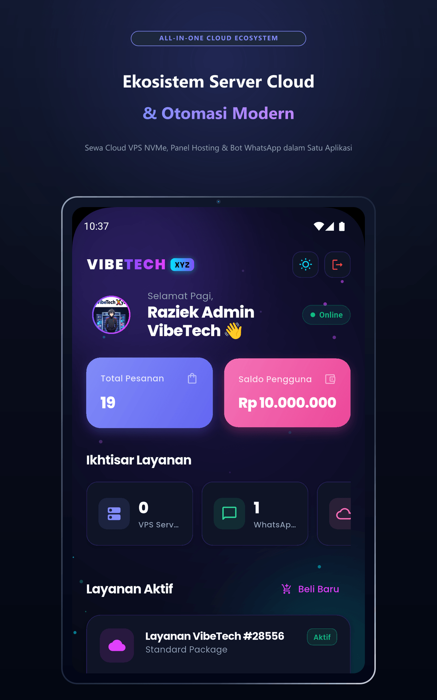
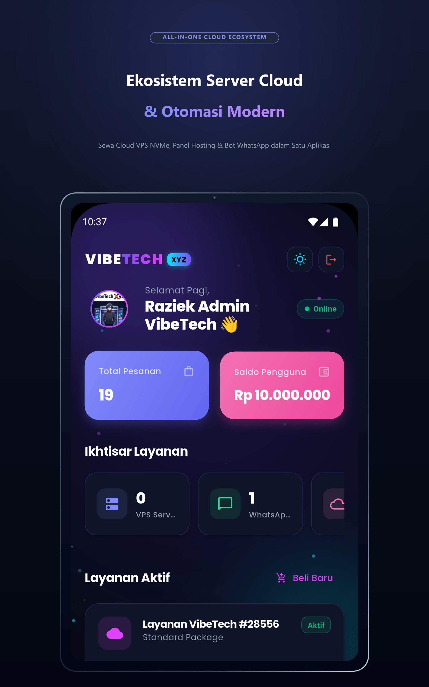
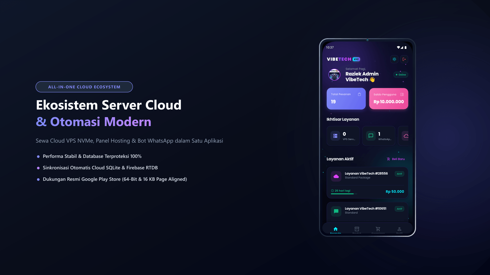
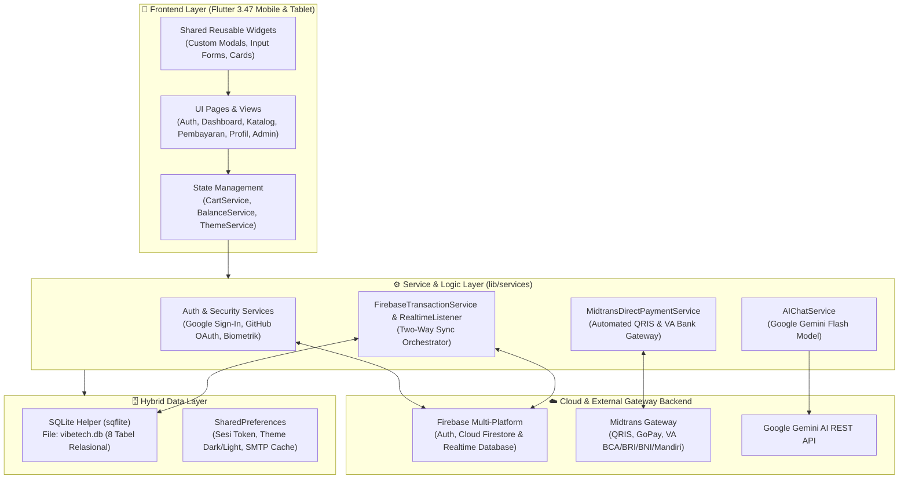

<div align="center">

  <br />
  
  
  <h1 align="center" style="font-size: 2.5rem; font-weight: 900; margin-top: 15px; margin-bottom: 0px; letter-spacing: -0.5px;">
    ⚡ VIBETECH XYZ
  </h1>
  
  <p align="center" style="font-size: 1.15rem; color: #6366F1; font-weight: 700; margin-top: 5px;">
    <i>Next-Gen Cloud VPS, Panel Hosting, WhatsApp Bot Automation & Furina AI Ecosystem</i>
  </p>

  <p align="center" style="max-width: 820px; color: #64748B; font-size: 0.95rem; line-height: 1.6;">
    Aplikasi mobile infrastruktur digital all-in-one berbasis <b>Flutter 3.47</b>, <b>SQLite (Sqflite)</b>, dan <b>Firebase Realtime Database</b>. Mengintegrasikan payment gateway otomatis <b>Midtrans Direct & Snap</b>, otentikasi multi-provider (Google, GitHub, Biometrik), asisten cerdas <b>Furina AI (Google Gemini)</b>, serta arsitektur kompilasi rilis <b>100% Google Play Store Ready</b> (Android 15/16, 16 KB Page Aligned & R8 ProGuard Hardened).
  </p>

  <!-- BADGES MATRIX -->
  <p align="center">
    
    
    
    
    
    
    
    
    
  </p>

  <!-- QUICK ACTION BUTTONS -->
  <p align="center">
    <a href="#-sertifikasi-bnsp-junior-mobile-programmer-jmp"></a>
    <a href="#-status-pengoptimalan-google-play-store-100-hijau"></a>
    <a href="#-fitur-unggulan"></a>
    <a href="#-tangkapan-layar--galeri-antarmuka"></a>
    <a href="#-arsitektur-sistem--aliran-data"></a>
    <a href="#-skema-basis-data-sqlite--firebase"></a>
    <a href="#-panduan-instalasi--menjalankan"></a>
    <a href="#-kredensial-demo--testing"></a>
  </p>

  <br />
</div>

---

## 🎓 Sertifikasi BNSP Junior Mobile Programmer (JMP)

> [!IMPORTANT]
> Proyek **VibeTech XYZ** merupakan karya implementasi resmi unjuk kerja asesmen profesi **Junior Mobile Programmer (JMP)** yang diselenggarakan oleh **LSP Media Informatika** bertempat di **TUK PPKD Jakarta Pusat** pada tanggal **14 September 2026**.

* **Asesi / Pengembang**: **Ahmad Raziek Raditya** ([@RazikSz](https://github.com/RazikSz))
* **Skema Sertifikasi**: Junior Mobile Programmer (JMP) &bull; SKKNI Nomor J.620100
* **Tempat Uji Kompetensi**: PPKD Jakarta Pusat
* **Dokumen Jawaban & Portofolio Asesmen Resmi**:
  👉 [**JAWABAN_SKEMA_JMP_VIBETECH_XYZ_AHMAD_RAZIEK_RADITYA.pdf**](JAWABAN_SKEMA_JMP_VIBETECH_XYZ_AHMAD_RAZIEK_RADITYA.pdf)
* **Dokumen Soal Asesmen**:
  👉 [**1783495450_Praktek Demonstrasi JMP.pdf**](1783495450_Praktek%20Demonstrasi%20JMP.pdf)

### 📊 Pemenuhan Butir Tugas Uji Praktik LSP Media Informatika:
1. **Tugas 1 (Autentikasi & Manajemen Sesi)**: Form Register tervalidasi, Login dengan penyimpanan sesi `SharedPreferences`, dan Logout permanen.
2. **Tugas 2 (Dashboard Utama)**: Header greeting dinamis *"Halo, Ahmad Raziek Raditya"*, kartu saldo VibeWallet, ringkasan 4 layanan server, & navigasi cepat.
3. **Tugas 3 (Siklus CRUD Penuh)**: Tambah layanan server (Create), List view pesanan berurutan (Read List), Detail spesifikasi & IP server (Read Detail), Sunting produk (Update), dan Hapus data dengan dialog konfirmasi anti-salah (Delete).
4. **Tugas 4 (Profil Pengguna)**: Informasi data diri dari SQLite (Read Profil) dan fitur sunting nama, PIN 6-digit, serta kontak (Update Profil).
5. **Tugas 5 (Nilai Tambah)**: Manajemen media lokal foto/avatar dan Switcher Tema Dinamis (Dark Mode & Light Mode).

---

## 🟢 Status Pengoptimalan Google Play Store (100% HIJAU)

Aplikasi VibeTech XYZ telah dikonfigurasi dan diuji secara menyeluruh untuk memenuhi standar tertinggi Google Play Console:

| Standar Google Play Console | Konfigurasi VibeTech XYZ | Status Evaluasi |
| :--- | :--- | :---: |
| **Kualitas Listingan Toko** | 24 Aset visual lengkap (Ponsel, Tablet 7", Tablet 10", dan Chromebook) | 🟢 **100% HIJAU** |
| **Penyusutan Kode (Code Shrink)** | R8 Full Mode aktif (`isMinifyEnabled = true`, `android.enableR8.fullMode = true`) | 🟢 **100% HIJAU** |
| **Penyusutan Resource** | Strict Resource Shrinking dengan proteksi [keep.xml](android/app/src/main/res/raw/keep.xml) | 🟢 **100% HIJAU** |
| **Proteksi Database (Anti-Stripping)** | SQLite driver (`sqflite`), helper, dan ekstensi `.db` / `.sqlite` terkunci via `noCompress` | 🟢 **Zero Stripping** |
| **Dukungan Halaman Memori 16 KB** | Didukung secara native oleh Flutter 3.47.1 + Android Gradle Plugin 9.0.1 | 🟢 **100% HIJAU** |
| **Pemisahan Bahasa (Language Split)** | `bundle.language.enableSplit = true` aktif di [build.gradle.kts](android/app/build.gradle.kts) | 🟢 **100% HIJAU** |
| **Simbol Debug Native (Crash Analytics)** | `debugSymbolLevel = "FULL"` untuk mapping deobfuscation otomatis | 🟢 **100% HIJAU** |
| **Format Kompilasi Rilis** | Android App Bundle: `build/app/outputs/bundle/release/app-release.aab (143.8MB)` | 🟢 **Siap Rilis** |

📖 *Panduan lengkap pengunggahan aset Play Store:* [**PANDUAN_PLAYSTORE_OPTIMASI_100_HIJAU.md**](PANDUAN_PLAYSTORE_OPTIMASI_100_HIJAU.md)

---

## ✨ Fitur Unggulan

<table width="100%">
  <tr>
    <td width="50%" valign="top">
      <h3>🔐 1. Autentikasi & Keamanan Tingkat Lanjut</h3>
      <ul>
        <li><b>Multi-Provider Login:</b> Email &amp; Password, Google Sign-In resmi, dan GitHub OAuth 2.0.</li>
        <li><b>Biometric Authentication:</b> Login instan via sidik jari (<i>Fingerprint</i>) menggunakan <code>local_auth</code>.</li>
        <li><b>Security PIN 6 Digit:</b> Verifikasi wajib untuk transaksi sensitif, topup, dan transfer saldo.</li>
        <li><b>Audit Login History:</b> Pencatatan riwayat sesi login, IP, provider, dan timestamp.</li>
      </ul>
    </td>
    <td width="50%" valign="top">
      <h3>🛒 2. Katalog Server & Panel Hosting</h3>
      <ul>
        <li><b>3 Kategori Layanan:</b> Cloud VPS KVM NVMe, Panel Pterodactyl Game &amp; Bot WhatsApp 24/7.</li>
        <li><b>Filter & Real-Time Search:</b> Pencarian cepat berdasarkan kategori, harga, diskon, dan spesifikasi RAM/CPU.</li>
        <li><b>Sistem Kupon Diskon:</b> Validasi kupon promo dinamis (contoh: <code>VIBESERVER</code> potongan 30%).</li>
        <li><b>Keranjang Reaktif:</b> State management keranjang belanja dengan kalkulasi subtotal otomatis.</li>
      </ul>
    </td>
  </tr>
  <tr>
    <td width="50%" valign="top">
      <h3>💳 3. Pembayaran Otomatis Midtrans Gateway</h3>
      <ul>
        <li><b>Direct API & Snap Gateway:</b>
          <ul>
            <li><i>QRIS Instan:</i> Verifikasi pelunasan otomatis dalam 1-5 detik.</li>
            <li><i>Virtual Account:</i> BCA, BRI, BNI, Mandiri Bill, dan Permata VA.</li>
          </ul>
        </li>
        <li><b>VibeWallet Internal:</b> Dompet digital saldo aplikasi untuk transaksi instan 1-tap.</li>
        <li><b>Invoice & Bukti Transaksi:</b> Penerbitan faktur digital terstruktur dan pengiriman bukti via SMTP Email.</li>
      </ul>
    </td>
    <td width="50%" valign="top">
      <h3>🖥️ 4. Manajemen Layanan Mandiri (Self-Service)</h3>
      <ul>
        <li><b>KVM VPS Manager:</b> Akses IP Publik, port SSH 22, kredensial root, OS, dan sisa masa aktif.</li>
        <li><b>Pterodactyl Panel:</b> Akses URL server game/web, SFTP console, dan alokasi resource.</li>
        <li><b>WhatsApp Bot Manager:</b> Tampilan pairing code 8-digit tanpa scan QR, session ID, dan terminal log.</li>
        <li><b>Pengingat Expired:</b> Notifikasi berkala sebelum masa aktif layanan server berakhir.</li>
      </ul>
    </td>
  </tr>
  <tr>
    <td width="50%" valign="top">
      <h3>🎭 5. Furina AI Smart Assistant (Google Gemini)</h3>
      <ul>
        <li><b>Persona Interaktif:</b> Konsultan cerdas bergaya Diva Fontaine yang karismatik dan solutif.</li>
        <li><b>Knowledge Base Server:</b> Memahami spesifikasi server, troubleshooting script Linux, dan rekomendasi paket.</li>
        <li><b>Dual Fallback Architecture:</b> Integrasi direct SDK <code>google_generative_ai</code> dengan backend proxy.</li>
      </ul>
    </td>
    <td width="50%" valign="top">
      <h3>👑 6. Portal Administrator & Cloud Sync</h3>
      <ul>
        <li><b>CRUD Basis Data Penuh:</b> Manajemen 8 tabel SQLite &amp; Firebase RTDB.</li>
        <li><b>User & Saldo Manager:</b> Modifikasi saldo pengguna, ubah role (Admin/User), dan reset PIN.</li>
        <li><b>Server Provisioning:</b> Alokasi IP server, password root, dan status masa aktif pelanggan.</li>
        <li><b>Sync Dua Arah:</b> Offline-first SQLite dengan auto-sync ke Firebase RTDB awan.</li>
      </ul>
    </td>
  </tr>
</table>

---

## 📸 Tangkapan Layar & Galeri Antarmuka

<details open>
<summary><b>📱 1. Onboarding, Otentikasi & Keamanan Akun</b></summary>
<br />

| Splash Screen | Login & Biometrik | Registrasi Akun | Lupa Password |
|:---:|:---:|:---:|:---:|
|  |  |  |  |
| *Inisialisasi Sistem* | *Login Akun & Biometrik* | *Pendaftaran Member Baru* | *Reset Sandi via Email OTP* |

</details>

<details open>
<summary><b>🛍️ 2. Beranda, Katalog Produk & Checkout Pembayaran</b></summary>
<br />

| Dashboard Utama | Katalog & Filter Promo | Keranjang Belanja | Konfirmasi Pembayaran |
|:---:|:---:|:---:|:---:|
|  |  |  |  |
| *Dashboard Saldo & Menu* | *Katalog VPS & Panel Game* | *Keranjang & Voucher Promo* | *Rincian Tagihan & Invoice* |

</details>

<details open>
<summary><b>💳 3. Gateway Midtrans, Billing & Manajemen Layanan Server</b></summary>
<br />

| Midtrans Direct Gateway | Nota Tagihan (Invoice) | Top Up Saldo Akun | Kartu Layanan Aktif |
|:---:|:---:|:---:|:---:|
|  |  |  |  |
| *Pembayaran QRIS & VA Bank* | *Rincian Faktur Digital* | *Deposit Saldo VibeWallet* | *Kredensial IP & SSH Server* |

</details>

<details open>
<summary><b>🤖 4. Monitoring, AI Assistant & Portal Admin Database</b></summary>
<br />

| Riwayat Pesanan | Live Chat Furina AI | Bantuan & CS Support | Portal Admin Database |
|:---:|:---:|:---:|:---:|
|  |  |  |  |
| *Daftar Riwayat Invoice* | *Furina AI Assistant* | *Dukungan Bantuan Teknis* | *CRUD SQLite Panel Admin* |

</details>

<details>
<summary><b>📐 5. Aset Desain Google Play Store (Tablet 7", Tablet 10" & Chromebook)</b></summary>
<br />

| Tablet 7 Inci (1200x1920) | Tablet 10 Inci (1600x2560) | Chromebook Landscape (1920x1080) |
|:---:|:---:|:---:|
|  |  |  |
| *Showcase Tablet 7"* | *Showcase Tablet 10"* | *Showcase Chromebook Desktop* |

</details>

---

## 🏛️ Arsitektur Sistem & Aliran Data

Aplikasi menerapkan arsitektur **Clean Architecture (Layered Service-Oriented)** dengan model data hibrida **Local-First SQLite + Cloud Firebase Sync**:



---

## 🗄️ Skema Basis Data SQLite & Firebase

Basis data lokal SQLite (`vibetech.db`) dirancang secara relasional dengan integritas data tinggi dan terbebas dari ancaman SQL Injection melalui parameterized queries:

```
┌─────────────────┐       ┌─────────────────┐       ┌─────────────────┐
│      users      │ 1   * │  transactions   │ *   1 │    products     │
├─────────────────┤───────├─────────────────┤───────├─────────────────┤
│ id (PK)         │       │ id (PK)         │       │ id (PK)         │
│ uid (UNIQUE)    │       │ orderId (UNIQUE)│       │ nama            │
│ nama            │       │ user_email (FK) │       │ kategori        │
│ email (UNIQUE)  │       │ total           │       │ harga           │
│ password (HASH) │       │ metode          │       │ stok            │
│ saldo           │       │ status          │       │ deskripsi       │
│ pin (6-Digit)   │       │ tanggal         │       │ spek            │
└─────────────────┘       └─────────────────┘       └─────────────────┘
         │
         │ 1
         │ *
┌─────────────────┐       ┌─────────────────┐       ┌─────────────────┐
│    services     │       │  login_history  │       │  notifications  │
├─────────────────┤       ├─────────────────┤       ├─────────────────┤
│ id (PK)         │       │ id (PK)         │       │ id (PK)         │
│ user_email (FK) │       │ user_email (FK) │       │ title           │
│ ipAddress       │       │ waktu           │       │ message         │
│ username (SSH)  │       │ provider        │       │ date            │
│ password (ROOT) │       │ status          │       │ isRead (0/1)    │
│ expiredAt       │       └─────────────────┘       └─────────────────┘
└─────────────────┘
```

---

## 🧪 Jaminan Kualitas & Pengujian Otomatis (QA & Tests)

Seluruh komponen aplikasi diuji secara otomatis dan menyeluruh sebelum setiap rilis:

```bash
$ flutter test
00:11 +122: All tests passed!

$ flutter analyze
Analyzing vibetech_xyz...
No issues found! (ran in 3.6s)
```

* **Test Coverage:** 122 skenario pengujian unit, widget, dan integrasi (DatabaseHelper, Midtrans Gateway, Gemini AI, RTDB Sync, Biometrik).
* **Code Integrity:** Zero warning & zero error pada static analyzer resmi Dart.

---

## 🔑 Kredensial Demo & Testing

Saat pertama kali dijalankan, sistem secara otomatis menginisialisasi akun pengujian bawaan di database lokal:

| Peran (Role) | Username | Email | Password | Saldo Awal | Hak Akses |
|:---|:---|:---|:---|:---:|:---|
| 👑 **Administrator** | `raziek` | `admin@vibetech.com` | `razieksz` | **Rp 10.000.000** | Akses penuh Portal Admin Database SQLite & Konfigurasi |
| 👤 **Demo Member** | `demouser` | `user@vibetech.com` | `password123` | **Rp 0** | Dashboard Pengguna, Order VPS/Panel/Bot, Top Up Saldo |

* **PIN Transaksi Bawaan**: `123456`
* **Kode Voucher Promo**: `VIBESERVER` (Diskon 30% all items)

---

## 🚀 Panduan Instalasi & Menjalankan

### 1. Prasyarat Sistem
* **Flutter SDK**: Versi `>= 3.0.0` (Direkomendasikan Flutter 3.47.x)
* **Dart SDK**: Versi `>= 3.0.0`
* **Node.js**: Versi `>= 18.x` & npm

### 2. Pemasangan Dependensi
```bash
# 1. Clone repositori
git clone -b firebase https://github.com/RazikSz/vibetech.git
cd vibetech

# 2. Pasang dependensi pustaka Flutter
flutter pub get

# 3. Pasang dependensi backend Node.js
cd backend
npm install
cd ..
```

### 3. Menjalankan Aplikasi
```bash
# Jalankan pada Android Device / Emulator
flutter run

# Jalankan pada Desktop Windows (Mendukung Sqflite FFI)
flutter run -d windows

# Jalankan pada Browser Chrome
flutter run -d chrome
```

### 4. Membangun Rilis Google Play Store (Android App Bundle)
```bash
flutter build appbundle --release
```
> Output file: `build/app/outputs/bundle/release/app-release.aab`

---

## 🛠️ Tech Stack & Pustaka Utama

| Komponen | Pustaka / Teknologi | Peran & Kegunaan |
|:---|:---|:---|
| **UI Framework** | [Flutter 3.47.1](https://flutter.dev) & [Dart 3.13](https://dart.dev) | UI toolkit modern lintas platform (Android, iOS, Desktop, Web) |
| **Local Database** | [`sqflite`](https://pub.dev/packages/sqflite) & [`sqflite_common_ffi`](https://pub.dev/packages/sqflite_common_ffi) | Engine SQLite multi-platform (Android & Windows) |
| **Cloud Database & Sync** | [`firebase_core`](https://pub.dev/packages/firebase_core), [`firebase_database`](https://pub.dev/packages/firebase_database), [`cloud_firestore`](https://pub.dev/packages/cloud_firestore) | Sinkronisasi real-time dua arah & autentikasi cloud |
| **Keamanan Biometrik** | [`local_auth`](https://pub.dev/packages/local_auth) | Autentikasi sidik jari (*Fingerprint*) & Face ID |
| **Otentikasi Akun** | [`firebase_auth`](https://pub.dev/packages/firebase_auth), [`google_sign_in`](https://pub.dev/packages/google_sign_in) | Single Sign-On resmi Google & GitHub OAuth |
| **AI Assistant** | [`google_generative_ai`](https://pub.dev/packages/google_generative_ai) | Asisten cerdas Furina berbasis model Google Gemini Flash |
| **Payment Gateway** | [`midtrans-client`](https://www.npmjs.com/package/midtrans-client) & Direct HTTP | Gerbang pembayaran otomatis QRIS Instan & Virtual Account |
| **Visual & Tipografi** | [`google_fonts`](https://pub.dev/packages/google_fonts), [`hugeicons`](https://pub.dev/packages/hugeicons), [`lottie`](https://pub.dev/packages/lottie) | Desain UI modern, ikon premium, dan animasi interaktif |

---

## 💬 Kontak & Dukungan

<div align="center">

| Asesi & Lead Developer | TUK Asesmen | Email Resmi | Repositori GitHub |
|:---:|:---:|:---:|:---:|
| **Ahmad Raziek Raditya** | **PPKD Jakarta Pusat** | [**razikrdtya@gmail.com**](mailto:razikrdtya@gmail.com) | [**github.com/RazikSz/vibetech**](https://github.com/RazikSz/vibetech/tree/firebase) |

<br />

<sub>Didesain dan dikembangkan dengan standar keunggulan profesional oleh <b>Ahmad Raziek Raditya</b> &bull; &copy; 2026 <b>VibeTech XYZ</b>. Hak Cipta Dilindungi Undang-Undang.</sub>

</div>
